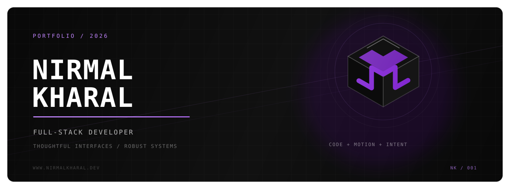
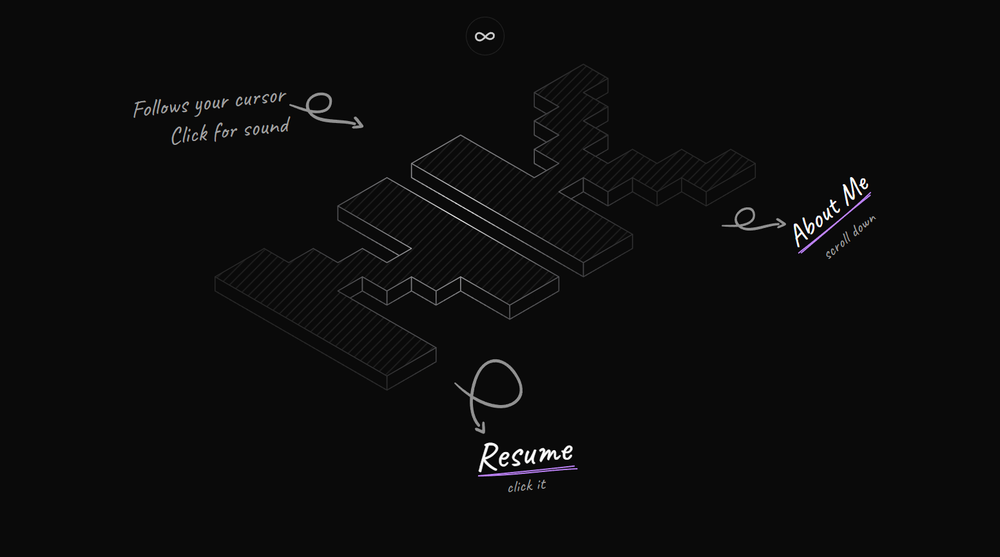

[](https://www.nirmalkharal.dev)

<p align="center">
  <strong>A portfolio for the details people usually scroll past.</strong>
</p>

<p align="center">
  <a href="https://www.nirmalkharal.dev"><strong>Enter the portfolio</strong></a>
  &nbsp;&nbsp;/&nbsp;&nbsp;
  <a href="public/resume/NirmalKharal-Resume.pdf">Resume</a>
  &nbsp;&nbsp;/&nbsp;&nbsp;
  <a href="https://github.com/kharalnirmal">GitHub</a>
  &nbsp;&nbsp;/&nbsp;&nbsp;
  <a href="https://www.linkedin.com/in/kharalnirmal/">LinkedIn</a>
</p>

<br />

<h1 align="center">Code was not the problem.<br />The idea was.</h1>

<p align="center">
  This is my digital playground: part portfolio, part interaction experiment, and part proof that a personal site does not need to feel like a template.
</p>

<br />

[](https://www.nirmalkharal.dev)

<p align="center"><sub>Move the cursor. Click the logo. Turn the sound on. The screenshot is only the quiet version.</sub></p>

## Not just another developer portfolio

The site is built around a tactile, editorial experience rather than a stack of static sections. The interface responds, shifts, makes sound, and reveals the work with just enough friction to feel human.

```text
01  A cursor-reactive isometric NK mark
02  A physical click interaction with generated audio
03  A pinned, horizontal project journey
04  Light and dark identities, not just inverted colors
05  Animated work and volunteering timelines
06  A cinematic footer that refuses to be an afterthought
```

## Built with


The visual system combines custom SVG geometry, spring interactions, scroll choreography, responsive typography, local theme persistence, and reduced-motion support. No canvas of generic cards. No stock gradient pretending to be a personality.

<details>
  <summary><strong>Look under the hood</strong></summary>
  <br />

```text
app/
|-- layout.tsx              metadata, fonts, and theme bootstrap
|-- page.tsx                the full portfolio composition
`-- globals.css             color system and global utilities

components/
|-- hero/                   interactive opening scene
|-- about/                  introduction and portrait
|-- work/                   pinned project showcase
|-- experience/             work and volunteering timeline
|-- footer/                 cinematic contact experience
`-- ui/                     logo, highlighter, theme, and primitives

lib/
|-- sound-engine.ts         browser audio synthesis
`-- metal-click.ts          tactile logo sound
```
</details>

## Run it locally

Requires [Node.js 20.9](https://nodejs.org/) or newer.

```bash
git clone https://github.com/kharalnirmal/nyxen.git
cd nyxen
npm install
npm run dev
```

Open [`http://localhost:3000`](http://localhost:3000), then interact with everything that looks suspiciously clickable.

```bash
npm run lint     # check the codebase
npm run build    # create a production build
npm run start    # serve the production build
```

## Say hello

Have an idea that deserves more than the default layout?

[Email](mailto:nirmalkharal40@gmail.com) / [LinkedIn](https://www.linkedin.com/in/kharalnirmal/) / [Instagram](https://www.instagram.com/nirmalkharal/) / [Discord](https://discord.com/users/744494586705084426)

<br />

<p align="center">
  <code>THOUGHTFUL INTERFACES</code>&nbsp;&nbsp;&bull;&nbsp;&nbsp;<code>CREATIVE ENGINEERING</code>&nbsp;&nbsp;&bull;&nbsp;&nbsp;<code>BUILT WITH PURPOSE</code>
</p>

<p align="center"><sub>Designed and engineered by Nirmal Kharal.</sub></p>
